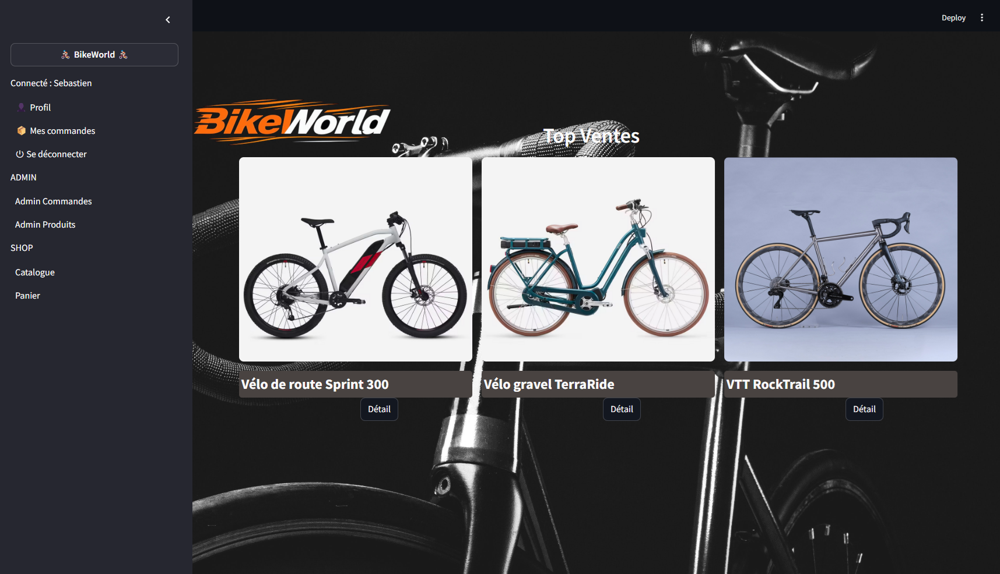
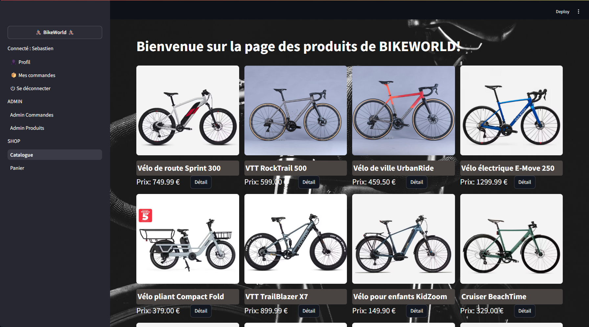
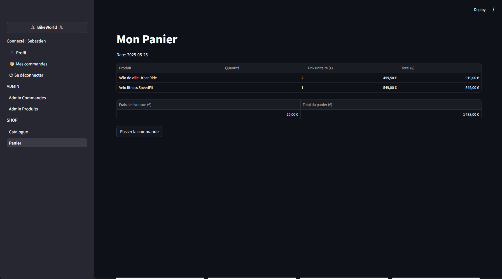

# 🚴 bikeworld
Site e-commerce de vente de vélos

Bienvenue sur ce projet dans le cadre de la formation **Data Engineering Bootcamp – Simplon HDF 2025**.  

Projet à rendre à la fin du 5eme jour.


# 🎯 Objectif

Développer une boutique, sélectionner et acheter des vélos, tout en offrant une interface d’administration pour gérer les produits et les commandes.


# 📌 Fonctionnalités principales

**Page d’accueil**
-    Afficher les produits les plus populaires, déterminés par le nombre de ventes ou de consultations.,

**Catalogue des produits**
-    Présenter l’ensemble des produits disponibles,

**Détail d’un produit**
-    Fournir une page dédiée à chaque produit avec des informations détaillées : description, spécifications techniques, images et prix.,

**Panier d’achat**
-    Permettre aux utilisateurs d’ajouter ou de retirer des produits de leur panier.
-    Afficher le récapitulatif du panier avec le total à payer.
-    Implémenter un processus de commande simulé (pas de paiement réel), enregistrant les informations nécessaires : produits commandés, quantités, date de commande, et informations utilisateur.


## 🛠️ Technologies Utilisées
  
-   🐍 Python

-   🖥️ streamlit

-   🍃 mongodb


## 📁 Structure du projet
  
```
bikeworld/
├── .streamlit/
│   └── config.toml
│
├── db/
│   ├── data.json
│   └── mongo.py
│
├── images/
│   └── ...
│
├── src/
│   ├── controllers
│   │   ├── commande_controller.py
│   │   ├── produit_controller.py
│   │   └── utilisateur_controller.py
│   │
│   ├── models
│   │   ├── adresse.py
│   │   ├── commande.py
│   │   ├── panier.py
│   │   ├── produit_commande.py
│   │   ├── produit.py
│   │   └── utilisateur.py
│   │
│   ├── pages
│   │   ├── admin_commandes.py
│   │   ├── admin_graph_ventes.py
│   │   ├── admin_produit.py
│   │   ├── adresse.py
│   │   ├── bikeworld.py
│   │   ├── catalogue.py
│   │   ├── commandes.py
│   │   ├── connexion.py
│   │   ├── deconnexion.py
│   │   ├── inscription.py
│   │   ├── panier.py
│   │   ├── produit.py
│   │   ├── profil.py
│   │   └── sidebar.py
│   │
│   ├── tools
│   │   ├── session.py
│   │   └── security.py
│   │
│   ├── accueil.py
│   └── style.css
│
├── .gitignore
├── LICENSE
├── README.md
└── requirements.txt

```
  
  
## 🖼️ Exemples d'affichages
  
Quelques exemples d'affichage:  
  





  
  
## 🚀 Mise en route  
  
### 📦 Installation  
  
```bash  
git clone https://github.com/AniceGit/bikeworld-mongodb.git
cd bikeworld

sur linux
python3 -m venv .venv
source venv/bin/activate

sur windows
python -m venv .venv
.\.venv\Scripts\Activate.ps1

pip install -r requirements.txt

installer mongodb: https://www.mongodb.com/try/download/community
lancer le script mongo.py


```


## 🧪 Lancer l'application

Une fois les dépendences installées et la base de données créée:

```bash
python -m streamlit run src/accueil.py
```

## 📜 License

This project is licensed under the MIT License ©️ 2025.  
You are free to use, modify, and distribute this project with proper attribution.


## 👥 L'équipe

Ce projet a été créé dans le cadre de la formation **Data Engineering Bootcamp – Simplon HDF 2025**.  par une équipe de 3 apprenants:

🔗 [Anice Guiren](https://github.com/AniceGit)  
🔗 [Sébastien Dewaelle](https://github.com/cebdewaelle)  
🔗 [Stéphane Muller](https://github.com/smuller59)

